# Serial Communication - Part I

</br>

In this part, we will skip the theory we already covered in the first part of this practice and go straight to the point. In this section, we will see **how to use the `sprintf` function**, which we used in the previous practice without fully understanding what it did, to send data in ASCII encoding 🤢. Next, we will also learn **how to send data in _raw_ format**.

Since this will take us little time, we will take the opportunity to introduce a **team workflow** for developing projects based on STM32Cube. We will see that the workflow to use is not trivial. So, pay close attention and try to understand everything we do, as **this will be the _workflow_ you will need to use in your project**!

## Objectives

- Introduction to serial communication in STM32Cube.
- `sprintf` function.
- Sending _raw_ data.
- Team _workflow_ in STM32Cube.

## Procedure

### Let's send an ASCII, shall we?

We start by sending "Hello, I am STM32." in ASCII from the microcontroller to the computer.

#### Project creation and configuration

From the `main` branch, create a branch called `stm32cube/<username>/serial-ascii` and create a project — you already know where — called `serial-ascii`.

The first thing we will do is see how to **configure the USART peripheral** of our microcontroller. This peripheral handles asynchronous serial communication.

Let me correct myself: we will see how STM32CubeMX has configured the USART for us. When initializing peripherals, **USART is configured by default** with **115200 8N1** settings. We will examine this because, in the challenge, we will need to configure a second USART peripheral that is not set up by default.

The first thing we should check is the `Pinout view`. There, we can see that **`PA2` and `PA3` are the TX and RX pins**, respectively, for our asynchronous communication with the computer. The **GNDs** of the microcontroller and the computer are **connected to each other via the USB cable**.

We can see how STM32CubeMX has configured the USART from the **left sidebar menu `Connectivity > USART2`**.


As we can see, configuring the USART is very simple. We just select **asynchronous mode** in the `Mode` field and, at the bottom, set the **communication parameters**: _baud rate_, data bits, parity, and number of stop bits. We can choose whether to establish bidirectional or unidirectional communication (and its direction). Finally, there is _oversampling_. This determines how the microcontroller captures received bits without using a clock signal. We won’t go into detail about what it does, but we will leave it at 16 samples.

Super easy. Now, **configure the button with an interrupt** so that **in the _callback_ of this interrupt, we send the phrase "Hello, I am STM32."**. No, I’m not going to tell you how to configure the GPIOs and their interrupts 😭

Once that’s done, we save the configuration file and generate the code.

#### ASCII-encoded data

Now in our beloved `app.c`, we implement the **_callback_ for our GPIO interrupt** and **use** the `HAL_USART_Transmit` function there. This function takes the following **parameters**: the **USART configuration**, a **pointer to an _array_** containing the data to be sent, a number indicating **how many elements of that _array_ we want to send**, and a **maximum time**, in milliseconds, to perform the action. The _callback_ would look like this:

```c
void HAL_GPIO_EXTI_Callback (uint16_t GPIO_Pin) {

	// send <txBufferElements> packets of data in txBuffer
	HAL_UART_Transmit(&huart2, txBuffer, txBufferElements, 100);

}
```

As you can see, we have used two variables: `txBuffer` and `txBufferElements`. The first one is an _array_ where we will store the elements to be sent. The second one is the number of elements in that _array_ that we will send. Let's create these variables:

```c
uint8_t txBuffer[TX_BUFFER_SIZE] = { 0 };
uint8_t txBufferElements = 0;
```

You can see that to create the _array_, we specified the number of elements in that _array_ (its size) using a macro. **Define that macro** and set its **value to 32**. Our `app.c` file should look like this:

```c
#include "main.h"

#define TX_BUFFER_SIZE 32

extern UART_HandleTypeDef huart2;

uint8_t txBuffer[TX_BUFFER_SIZE] = { 0 };
uint8_t txBufferElements = 0;

void setup(void)
{
}

void loop(void)
{
}

void HAL_GPIO_EXTI_Callback (uint16_t GPIO_Pin) {

	// send <txBufferElements> packets of data in txBuffer
	HAL_UART_Transmit(&huart2, txBuffer, txBufferElements, 100);

}
```

> [!TIP]
> You should choose a _buffer_ size that fits your application. Not too large, as it would waste memory space unnecessarily, nor too small, as you might not have enough space to store everything you need. In this case, the text "Hello, I am STM32." takes up 16 bytes plus 2 _term char_ characters (`\r`+`\n`). A _buffer_ with a size of 32 elements will be more than sufficient.

Once the _buffer_ is defined, we will store the text to be sent in it. We will do this using the `sprintf` function.

#### The sprintf function

The **`sprintf` function** is part of the **standard library `stdio.h`**, so even though the program may compile without error, we must **include that library with `#include <stdio.h>`**. The function requires **at least two parameters**: a pointer to the _buffer_ where we want to store the text and the text _pattern_.

We want to store the text in the `txBuffer` _buffer_ that we created. Each element of the _array_ will contain a character in ASCII encoding.

The second parameter is a text _pattern_. This is the text template that will be stored in `txBuffer`. Why do we call it a _pattern_ or text template? Because we can use _tags_ (identified by the `%` character) that can be replaced with values passed as the third, fourth, fifth, ..., parameter of the `sprintf` function. Some examples:

```c
txBufferElements = sprintf(txBuffer, "Hello, I am STM32.\r\n");
```

In this example, we do not use any _tags_, and the text we specified will be stored in `txBuffer` as-is in ASCII encoding.

```c
txBufferElements = sprintf(txBuffer, "Hello, I am STM%u.\r\n", 32);
```

In this case, we have stored exactly the same text, but we used a _tag_ (%u) so that it is replaced by the next parameter of the function (32). The parameters after the text template can be specified directly as a number or through a variable containing that number.

```c
txBufferElements = sprintf(txBuffer, "Hello, I am STM%u (%u).\r\n", 32, year);
```

Now we send the same text, but adding the year passed as a parameter to the function inside parentheses using a variable.

In this [link](https://www.tutorialspoint.com/c_standard_library/c_function_sprintf.htm), you will find another explanation of the `sprintf` function and a list of all available _tags_, since depending on the type of variable and the format we want to apply, we will need to use one _tag_ or another.

In addition to accepting parameters, **the `sprintf` function returns a value**. This value is the **number of characters in the stored text**. We will use it later to indicate to the USART the number of elements it must send. We store this value in the variable `txBufferElements`. Our `app.c` file would look as follows:

```c
#include "main.h"
#include <stdio.h>

#define TX_BUFFER_SIZE 32

extern UART_HandleTypeDef huart2;

uint8_t txBuffer[TX_BUFFER_SIZE] = { 0 };
uint8_t txBufferElements = 0;

void setup(void)
{
	txBufferElements = sprintf(txBuffer, "Hello, I am STM32.\r\n");
}

void loop(void)
{
}

void HAL_GPIO_EXTI_Callback (uint16_t GPIO_Pin) {

	// send <txBufferElements> packets of data in txBuffer
	HAL_UART_Transmit(&huart2, txBuffer, txBufferElements, 100);

}
```

We have placed the `sprintf` call inside the `setup` function because the message never changes, so there is no need to call `sprintf` repeatedly as we would if it were inside the `loop` function.

We compile, debug, and start the program execution. **We open CoolTerm**, select the **appropriate port**, and configure a **_baud rate_ of 115200 bps** in the options. We click on the `Connect` icon, and if we press the button on our EVB and everything is correct, our microcontroller will greet us on the screen 👋

Check that it works correctly. If so, make a commit, push your changes, and create a Pull Request to the main branch. Wait for the test results. If there are any issues, fix them, and once all tests pass, merge the Pull Request.

### Receiving _raw_ data with interrupts

I refuse to go over how to receive data in ASCII 😤 We're going straight to receiving _raw_ data 😆 Moreover, we'll see how to do it using interrupts, ensuring that the program doesn’t hang while waiting for data.

We will turn the LED on and off using the `0x01` and `0x02` instructions, respectively.

To do so, from the `main` branch, create a branch called `stm32cube/<username>/serial-led` and create a project called `serial-led`.

#### Interrupt Configuration

In the STM32CubeMX, navigate to the **USART2 configuration form**. In the **`NVIC Settings` tab of the lower form**, we **enable `USART2 global interrupt`**. Done! Interrupts configured.

#### _Callback_ and reception management

The documentation provides an easy way to enable reception using interrupts and explains which _callback_ to use. To enable reception via interrupts, we use the **`HAL_UART_Receive_IT` function**. We must specify **where to store the received bytes** and **how many we expect to receive**. We create a buffer to store the **received bytes in `rxBuffer`**. Since we only expect single-byte instructions, we will create an _array_ with a single element. The `app.c` would look like this:

```c
#include "main.h"

#define RX_BUFFER_SIZE 1

extern UART_HandleTypeDef huart2;

uint8_t rxBuffer[RX_BUFFER_SIZE] = { 0 };

void setup(void){
    // Indicates that the system is waiting to receive 1 byte
    HAL_UART_Receive_IT(&huart2, rxBuffer, RX_BUFFER_SIZE);
}

void loop(void){}
```

When that byte is received, the reception interrupt will trigger: the _callback_. The _callback_ function is `HAL_UART_RxCpltCallback`. We implement it as follows:

```c
#include "main.h"

#define RX_BUFFER_SIZE 1

extern UART_HandleTypeDef huart2;

uint8_t rxBuffer[RX_BUFFER_SIZE] = { 0 };

void setup(void){
    // Indicates that the system is waiting to receive 1 byte
    HAL_UART_Receive_IT(&huart2, rxBuffer, RX_BUFFER_SIZE);
}

void loop(void){}

void HAL_UART_RxCpltCallback (UART_HandleTypeDef *huart) {

	// we have received a byte
	// now we tell it that we are waiting to receive 1 byte again
	HAL_UART_Receive_IT(&huart2, rxBuffer, RX_BUFFER_SIZE);

}
```

With this, we would have the reception of a byte ready. Now we need to make the LED turn on/off depending on the received byte. It might be tempting to put it inside the _callback_, but what would happen if, while we are managing the LED, we receive another byte? Well, it would be lost, basically. We need to keep ISRs/_callbacks_ as short as possible to avoid this.

Therefore, **we should manage the LED directly in the `loop` function**. For now, **we will do it in the _callback_**. In a couple of practices, we will see how to do it properly.

> [!NOTE]
> You’ll see that we’ll dedicate a few practices to communications because, while it’s very "simple" to operate individual peripherals of a microcontroller, when you have to communicate with someone else, like in real life, things get complicated. Therefore, we will spread everything related to communications across several practices to avoid overwhelming ourselves by trying to cover it all in one, which would be impossible...

Our _callback_ should look like this:

```c
#include "main.h"

#define RX_BUFFER_SIZE 1

extern UART_HandleTypeDef huart2;

uint8_t rxBuffer[RX_BUFFER_SIZE] = { 0 };

void setup(void){
    // Indicates that the system is waiting to receive 1 byte
    HAL_UART_Receive_IT(&huart2, rxBuffer, RX_BUFFER_SIZE);
}

void loop(void){}

void HAL_UART_RxCpltCallback (UART_HandleTypeDef *huart) {

	switch(rxBuffer[0]) {
	case 0x01:
	  HAL_GPIO_WritePin(LED_GPIO_Port, LED_Pin, GPIO_PIN_SET);
	  break;
	case 0x02:
	  HAL_GPIO_WritePin(LED_GPIO_Port, LED_Pin, GPIO_PIN_RESET);
	  break;
	default:
	  break;
	}

	// we have received a byte
	// now we tell it that we are waiting to receive 1 byte again
	HAL_UART_Receive_IT(&huart2, rxBuffer, 1);

}
```

We compile, debug, and start the program. If everything is correct, **send a 1 in hexadecimal from CoolTerm and the LED should turn on**. **With a 2, it should turn off.** But..., with a simple Arduino, we returned a **status byte to indicate whether a valid instruction was sent (`0x00`) or not (`0x01`)**. Let's implement that in a moment:

```c
#include "main.h"

#define RX_BUFFER_SIZE 1
#define TX_BUFFER_SIZE 1

extern UART_HandleTypeDef huart2;

uint8_t rxBuffer[RX_BUFFER_SIZE] = { 0 };
uint8_t txBuffer[TX_BUFFER_SIZE] = { 0 };

void setup(void){
    // Indicates that the system is waiting to receive 1 byte
    HAL_UART_Receive_IT(&huart2, rxBuffer, RX_BUFFER_SIZE);
}

void loop(void){}

void HAL_UART_RxCpltCallback (UART_HandleTypeDef *huart) {

	switch(rxBuffer[0]) {
	case 0x01:
	  HAL_GPIO_WritePin(LED_GPIO_Port, LED_Pin, GPIO_PIN_SET);
	  txBuffer[0] = 0x00;
	  break;
	case 0x02:
	  HAL_GPIO_WritePin(LED_GPIO_Port, LED_Pin, GPIO_PIN_RESET);
	  txBuffer[0] = 0x00;
	  break;
	default:
	  txBuffer[0] = 0x01;
	  break;
	}

	// we send the status byte
	HAL_UART_Transmit(&huart2, txBuffer, TX_BUFFER_SIZE, 100);

	// we have received a byte
	// now we tell it that we are waiting to receive 1 byte again
	HAL_UART_Receive_IT(&huart2, rxBuffer, RX_BUFFER_SIZE);

}
```

We have used a transmission _buffer_ with a single element, `txBuffer`. We tested the program and we should be able to turn the LED on and off with `0x01` and `0x02` and receive a _status_ equal to `0x00`. If we send a different instruction, the microcontroller should return a _status_ `0x01`.

Check that it works correctly. If so, make a commit, push your changes, and create a Pull Request to the main branch. Wait for the test results. If there are any issues, fix them, and once all tests pass, merge the Pull Request.

## Challenge: _Workflow_ with STM32CubeIDE

The challenge will be a **team project**. In this challenge, we will **connect two EVBs using an asynchronous serial communication**. Additionally, each EVB will establish a **second asynchronous serial communication with the computer**, so that everything received from the other EVB will be sent to the computer. This way, we will have a **chat between computers** 🤓 We will send data in ASCII format so that we can read it... 😒

In this challenge, we will learn two new things: how to **work on projects with more than one file** and how to **work in teams on STM32Cube-based projects**.

### _Team Workflow_

We will **simplify** the _workflow_ to the maximum. We will see that by simplifying the _workflow_ so much, it will have some **limitations**. That’s the price to pay. Another option would be to use an advanced workflow that would only confuse us right now, as we are just getting started with team-based workflows. For now, read the workflow description, and in the next section, we will carry it out in a guided manner.

Below, you have the git tree we will follow in the repository to carry out our project. Use this figure to follow the workflow explanation.

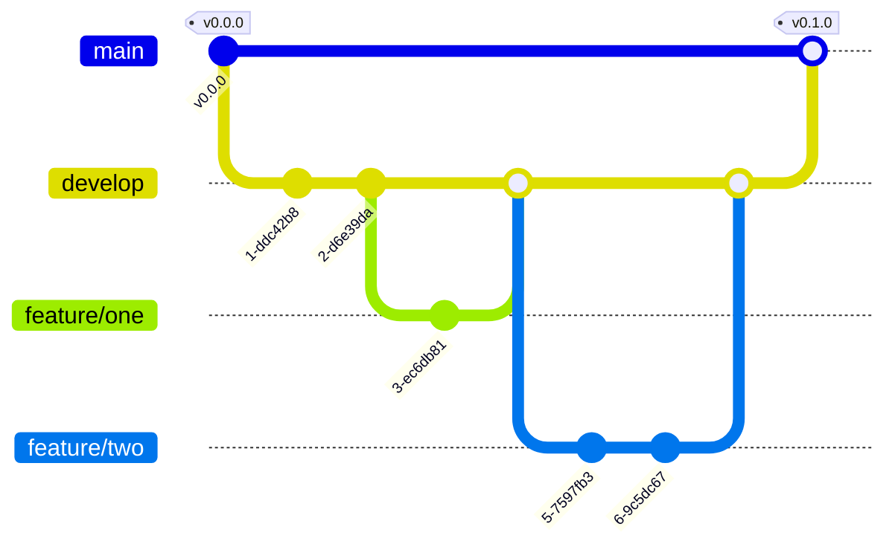

Let's start by reviewing what each branch is for and what we will do in each one:

- **main:** the branch containing production code. Production code is understood as the one that can be delivered to a customer and works 100%.
- **develop:** the branch containing our development. In this branch, all team members' developments are grouped and tested. Once its correct operation is validated, the contents of the `develop` branch are merged into the `main` branch to deliver to the customer.
- **feature/\*\*\*:** a branch containing the individual or collective development of a feature. The asterisks should be replaced with a descriptive term of the functionality being developed in that branch. The contents of this branch are merged into the `develop` branch once they have been tested.

Every time we want to start developing a new feature, we will create a `feature/***` branch from the `develop` branch. In this `feature/***` branch, **we will only modify files that we have created ourselves and not those generated automatically by STM32CubeMX**. **This is very important**. Once the development is finished and tested, we will merge it into the `develop` branch with a _Pull Request_.

If we need to modify the `.ioc` configuration file, that is, the STM32CubeMX config, we will do so directly in the `develop` branch. **In this branch, we will only modify the `.ioc` file and the files generated automatically by STM32CubeMX, including `main.c`. This is also very important.**

Here comes the **limitation**: **only one person can modify the `develop` branch at a time**. If two people do it at the same time, there will be conflicts when merging the branches. How do we proceed? The optimal way, and what I recommend, is that **only one person should be dedicated to modifying the `develop` branch**. When the `.ioc` file or a file generated by STM32CubeMX needs to be modified, **you should sit together in front of the same computer and edit it together** (one should tell the other what needs to be configured).

Is it a hassle? Yes. But it’s the **price to pay for a simpler _workflow_.**

If you created the `feature` branch before making the configuration, or if you changed the configuration in the middle of developing a feature to fix a bug, that configuration change won’t be in your `feature` branch. You will have to do a `git rebase`. Here's a cheat sheet on how to do it:

```bash
git switch develop
git pull
git switch feature/***
git rebase develop
git push --force-with-lease
```

Once all the desired functionalities have been incorporated into the `develop` branch and it has been verified that **everything works 100%**, a _Pull Request_ is made to the `main` branch and sent to the customer.

That's the description. Let's do everything step by step.

#### Branch Naming Policy

We have just described the branch naming policy defined by the GitFlow workflow. The names given above are what we should use, but since this repository contains both Arduino and STM32Cube developments, remember to group the corresponding branches using the `arduino` and `stm32cube` prefixes. Examples of branch names for STM32Cube:

- `stm32cube/develop`
- `stm32cube/feature/led`
- `stm32cube/fix/wrong-label`

Remember that the only exception is `main`, which must not have any prefix.

### Task Distribution

The directory structure of the `Core` folder in the STM32Cube-based project should be as follows (STM32CubeMX-generated files that do not need to be edited are not shown):

```txt
Core
├── Inc
│   ├── app.h
│   ├── usart1.h
│   └── usart2.h
└── Src
    ├── app.c
    ├── main.c
    ├── usart1.c
    └── usart2.c
```

Name the project `challenge`.

The files each member should work on are:

- Member `A`
  - Project creation.
  - Configuration of the `.ioc` file (STM32CubeMX).
  - Code generation.
  - `Core/Src/main.c`
  - `Core/Src/usart1.c`
  - `Core/Inc/usart1.h`
- Member `B`
  - `Core/Src/app.c`
  - `Core/Inc/app.h`
  - `Core/Src/usart2.c`
  - `Core/Inc/usart2.h`

Even though member `A` is responsible for creating the project, configuring it, generating the code, and modifying a part of the `main.c` code that we will see later, **this should be done together on the same computer by both members**. Once these tasks are completed, each member can return to their individual tasks.

Choose who will handle the tasks of member `A` and who will handle the tasks of member `B`. Before starting your task, make sure to read the tasks the other member must complete so that you always know how the workflow should proceed.

<details>
<summary><h3>Member A's Workflow</h3></summary>

#### Project creation and configuration

You are responsible for creating the project, and **until you finish, the other member cannot start developing**. Let's start by **going to the `main` branch** of your repository and make sure to **import any possible changes** that might have occurred in the remote repository.

```bash
git switch main
git pull
```

Next, **create a branch called `stm32cube/develop`**. This is where you and your teammate will merge your development to test it before pushing it to the `main` branch.

```bash
git switch -c stm32cube/develop
```

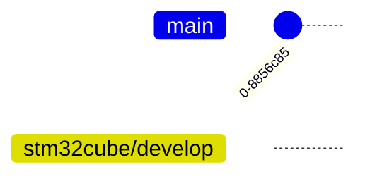

In the branch, **create a project in STM32CubeMX with the name `challenge`. Once created, configure the microcontroller** with STM32CubeMX.

> [!WARNING]
> Remember, you will do this together on a single computer.

You only need to configure one peripheral: USART1. USART2 is used for communication between the computer and the microcontroller. **For USART2**, just **enable the interrupts**. We will use USART1 to communicate our microcontroller with your teammate's. Configure **USART1** with the same settings as USART2: **115200 8N1** (don't forget to enable interrupts as well). Once configured, save the configuration file and generate the code. Make a **_commit_ of the modified files**. Don't forget the **_push_**.

```bash
git add -A
git commit -m "Project created and configured."
git push
```

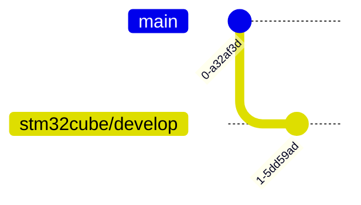

#### Modification of `main.c`

Simply implement the code organization we have been using with `setup` and `loop`.

> [!WARNING]
> Do NOT implement the `app.c` or `app.h` files, nor add anything to the `CMakeLists.txt` file. That is your teammate's responsibility. Simply include `app.h` in `main.c` and call the `setup` and `loop` functions from the `main` function.

Save the project and make a _commit_ and _push_.

```bash
git add -A
git commit -m "Added the setup and loop functions to the main function."
git push
```

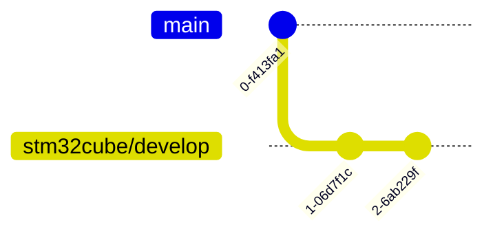

From here on, you can work individually.

#### usart1 Files

We will create the `usart1.c` and `usart1.h` files that will handle the management of USART1, the peripheral responsible for communication between microcontrollers.

The first thing we will do is, **from the `stm32cube/develop` branch**, create a **branch called `stm32cube/feature/usart1`**.

```bash
git switch -c stm32cube/feature/usart1
```

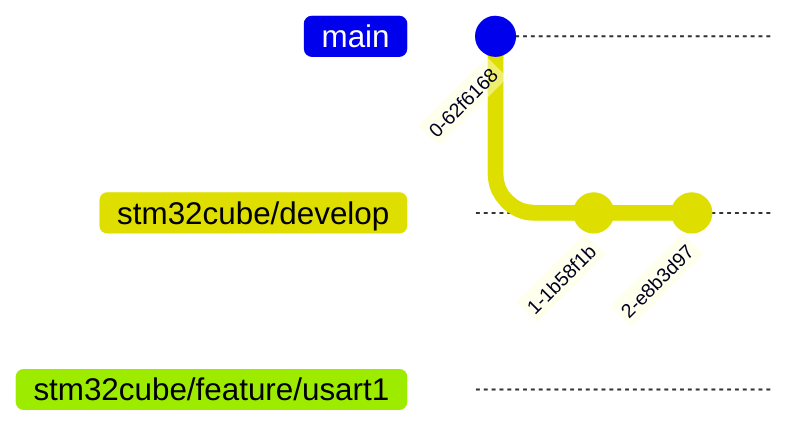

Next, we are going to **create the `usart1.c` file** in the `Core/Src` folder.

> [!WARNING]
> Now, remember to add the `usart1.c` file to `CMakeLists.txt`.

In this file, we add the following code, which is explained directly in the comments:

```c
// We include usartx.
// We include this to make the functions defined in
// the other files available.
#include "usart1.h"
#include "usart2.h"

// We create two single-element buffers for
uint8_t rxU1Buffer[USART1_BUFF_SIZE] = { 0 }, // receiving
	    txU1Buffer[USART1_BUFF_SIZE] = { 0 }; // and sending.

// The macro USART1_BUFF_SIZE will be defined in usart1.h.


// We declare the variable huart1 without defining it. We do this using the keyword extern.
// This way, we make the huart1 variable, which is defined in the main.c file, available.
extern UART_HandleTypeDef huart1;
// Function to start waiting for the reception of bytes using interrupts.
void UART1_start(void) {

	HAL_UART_Receive_IT(&huart1, rxU1Buffer, 1);

}
// Function we will use to send a byte passed as a parameter.
void UART1_transmit(uint8_t value) {

	txU1Buffer[0] = value;

	HAL_UART_Transmit_IT(&huart1, txU1Buffer, 1);

}

// Function that will be called from the callback upon receiving a byte.
// The received byte will be sent through the other USART.
void UART1_receive(void) {

	// We use this function from the other USART to send the byte.
	// This is why we needed to include the header of the other USART.
	UART2_transmit(rxU1Buffer[0]);

	// We go back to waiting for another byte.
	HAL_UART_Receive_IT(&huart1, rxU1Buffer, 1);

}
```

Now, we are going to **create the `usart1.h` file** in the `Core/Inc` folder. In this file, we will specify the function prototypes, variables, and macros that we want to be available for other source files that include this file. The content of the file would be as follows:

```c
#ifndef USART1_H__
#define USART1_H__

// Include this HAL header to use some HAL functionalities.
#include "main.h"

// Create a macro for the buffer size.
#define USART1_BUFF_SIZE 1

// Function prototypes to make them available in source files
// that include this header file.
void UART1_start(void); // Used in 'stm32main.c'
void UART1_transmit(uint8_t value); // Used in 'usart2.c'
void UART1_receive(void); // Used in 'stm32main.'


#endif /* USART1_H__ */
```

With this, we would have completed all our tasks. Save the project and make a _commit_ and a _push_.

```bash
git add -A
git commit -m "UART1 implemented."
git push
```

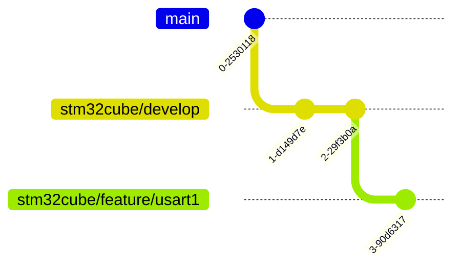

Now, all that's left is to go to the GitHub remote repository's website and create a **_Pull Request_ from our `stm32cube/feature/usart1` branch to the `stm32cube/develop` branch**, setting our **teammate as the _reviewer_**.

#### _Review_ and _merge_

Don't forget, when your teammate creates a _Pull Request_ from their `stm32cube/feature` branches to the `stm32cube/develop` branch, review their development and either approve it or request changes before merging the changes into the `stm32cube/develop` branch.

</details>

<details>
<summary><h3>Member B's Workflow</h3></summary>

First of all, **make sure you and your teammate complete the project creation, its configuration, and the small modification of the `main.c` file**. Once this is done, we can start.

#### app Files

We are going to create the files `app.c` and `app.h` as always.

First, **go to the `stm32cube/develop` branch** created by your teammate and pull in any possible changes from the remote repository. Then, create our development branch `stm32cube/feature/app`.

```bash
git switch stm32cube/develop
git pull
git switch -c stm32cube/feature/app
```

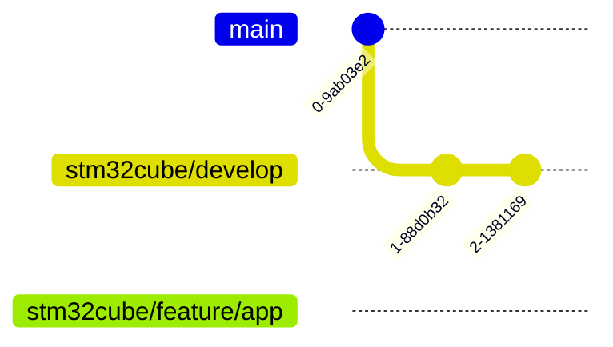

Create the `app.c` and `app.h` files as usual, and add the following code to `app.c`:

```c
#include "main.h"
#include "usart1.h"
#include "usart2.h"


// Function that is executed only once
void setup(void) {

	UART1_start(); // Initialize USART1. Implemented by our teammate.
	UART2_start(); // Initialize USART2. Implemented by us.

}

// Function that repeats within the while loop
void loop(void) {
	// We do nothing
}

// Callback for the interrupt triggered by the reception of a byte
void HAL_UART_RxCpltCallback (UART_HandleTypeDef *huart) {

	// We check who received the byte, whether it was USART1 or USART2.
	if (huart->Instance == USART1) {
		UART1_receive(); // Implemented by our teammate.
	} else if (huart->Instance == USART2) {
		UART2_receive(); // Implemented by us.
	}

}
```

In our `app.h` file, we include the same content we have been using so far.

With this, we would have **finished this functionality**. Save the project and make a _commit_ and a _push_.

```bash
git add -A
git commit -m "STM32main implemented."
git push
```

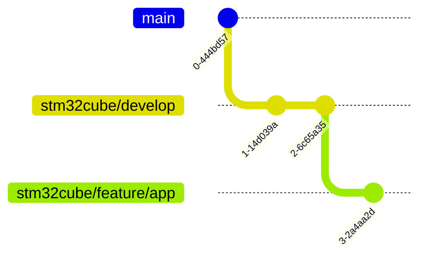

Now we just need to go to the remote repository's website on GitHub and create a _Pull Request_ from our `stm32cube/feature/app` branch to the `stm32cube/develop` branch, setting our teammate as the _reviewer_. Let's move on to the next functionality: USART2.

#### usart2 Files

We are going to create the `usart2.c` and `usart2.h` files, which will handle the management of USART2, the peripheral responsible for communication between the microcontroller and the computer.

The first thing we will do is, **from the `stm32cube/develop` branch**, create a branch called `stm32cube/feature/usart2`.

```bash
git switch stm32cube/develop
git pull
git switch -c stm32cube/feature/usart2
```

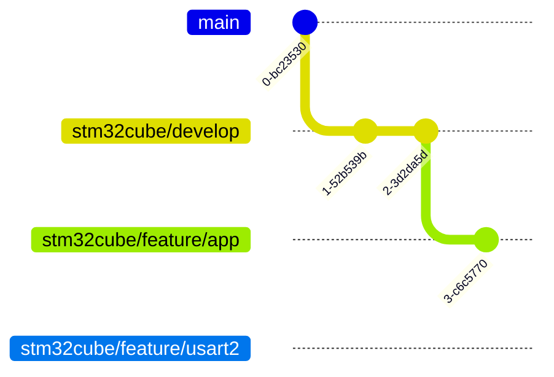

Next, we will **create the `usart2.c` file** in `Core/Src` folder. In this file, we will add the following code, with explanations provided directly in the comments:

```c
// Include components/usartx.
// We include this to make the functions defined in
// the other files available.
#include "usart2.h"
#include "usart1.h"

// Create two single-element buffers for
uint8_t rxU2Buffer[USART2_BUFF_SIZE] = { 0 }, // receiving
		txU2Buffer[USART2_BUFF_SIZE] = { 0 }; // and sending.

// The macro USART2_BUFF_SIZE will be defined in usart2.h.


// Declare the variable huart2 without defining it. We do this using the keyword extern.
// This way, we make the huart2 variable, which is defined in the main.c file, available.
extern UART_HandleTypeDef huart2;

// Function to start waiting for the reception of bytes using interrupts.
void UART2_start(void) {

	HAL_UART_Receive_IT(&huart2, rxU2Buffer, 1);

}
// Function we will use to send a byte passed as a parameter.
void UART2_transmit(uint8_t value) {

	txU2Buffer[0] = value;

	HAL_UART_Transmit_IT(&huart2, txU2Buffer, 1);

}

// Function that will be called from the callback upon receiving a byte.
// The received byte will be sent through the other USART.
void UART2_receive(void) {

	// We use this function from the other USART to send the byte.
	// This is why we needed to include the header of the other USART.
	UART1_transmit(rxU2Buffer[0]);

	// We go back to waiting for another byte.
	HAL_UART_Receive_IT(&huart2, rxU2Buffer, 1);

}
```

Now we are going to **create the `usart2.h` file** in the `Core/Inc` folder. To do this, right-click on the folder and select `New > Header File`. In this file, we will define the function prototypes, variables, and macros that we want to be available to other source files that include this file. The content of the file will be as follows:

```c
#ifndef USART2_H__
#define USART2_H__

// Include this HAL header to use some HAL functionalities.
#include "main.h"

// Create a macro for the buffer size.
#define USART2_BUFF_SIZE 1

// Function prototypes to make them available in source files
// that include this header file.
void UART2_start(void); // Used in 'app.c'
void UART2_transmit(uint8_t value); // Used in 'usart1.c'
void UART2_receive(void); // Used in 'app.c'


#endif /* USART2_H__ */
```

> [!WARNING]
> Remember to add the `usart2.c` file to `CMakeLists.txt`.

With this, we would have completed all our tasks. Save the project and make a _commit_ and a _push_.

```bash
git add -A
git commit -m "UART2 implemented."
git push
```

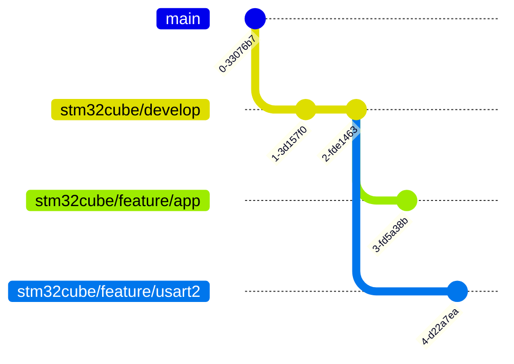

Now, all that's left is to go to the remote repository page on GitHub and create a _Pull Request_ from our `stm32cube/feature/usart2` branch to the `stm32cube/develop` branch, setting our teammate as the _reviewer_.

#### _Review_ and _merge_

Don't forget, when your teammate creates a _Pull Request_ from their `stm32cube/feature` branches to the `stm32cube/develop` branch, review their developments and approve or request changes before merging the changes into the `stm32cube/develop` branch.

</details>

### _Test and Pull Request_ to main

Once everything is _merged_ into the `stm32cube/develop` branch, upload the same project/code to both EVBs.

> [!TIP]
> Go to the `stm32cube/develop` branch and import all changes from the remote repository.
>
> ```bash
> git switch stm32cube/develop
> git pull
> ```

Next, **connect the two USART1 of both EVBs to each other**. The pins to use are **`PA9` (TX) and `PA10` (RX)**. Remember to **cross the pins** as indicated in the introduction of the first part of this practice. Also, remember to **connect the GNDs** of both EVBs. As always, it is recommended to **unplug the EVBs from any power source before making any connections**.


Next, each of you should open the **CoolTerm** application on your computer. Configure it by selecting the **appropriate port** and setting a **_baud rate_ of 115200 bps**. We will also adjust a small configuration to ensure the demonstration works correctly. Essentially, we need to **add a _delay_ between transmissions** and **add a carriage return and line feed when sending text**. This can be done from the `Transmit` submenu.


Test sending ASCII text, and what you send from one computer should appear on the other, and vice versa. **If it doesn't work**, you should **find the error in the project and fix it**. **Do not fix it directly in the `stm32cube/develop` branch**. Create a **new branch** (typically, branches used to fix a _bug_ are named `hotfix/***`, in our case, `stm32cube/hotfix/***`) and once the necessary changes are made, **merge them into the `stm32cube/develop` branch with a _Pull Request_ and retest**.

**If everything works** correctly, proceed to make a **_Pull Request_ from the `stm32cube/develop` branch to the `main`**. Wait for the test results. If there are any issues, fix them, and once all tests pass, merge the Pull Request.

Once everything is merged, your Git history will look as follows:

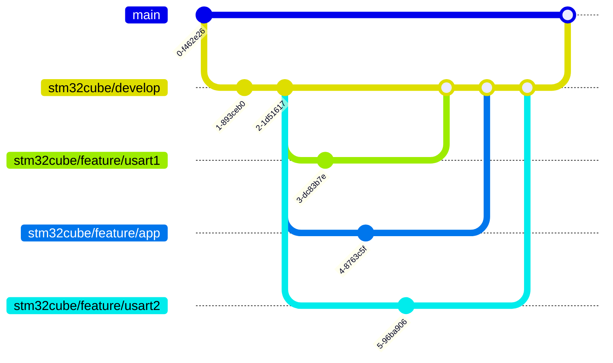

You've completed your first STM32Cube-based project as a team! 🥳

## Evaluation

### Deliverables

These are the elements that should be available to the teacher for your evaluation:

- [ ] **Commits**
      Your remote GitHub repository must contain at least the following required commits: serial-ascii, and serial-led.

- [ ] **Challenge**
      The challenge must be solved and included with its own commit.

- [ ] **Pull Requests**
      The different Pull Requests requested throughout the practice must also be present in your repository.

## Conclusions

Well, this was a very complete exercise where we saw **how to send ASCII-encoded data with STM32Cube** and used the **`sprintf` function** to format text. We also learned how to **receive _raw_ data through interrupts**.

Finally, we also explored **how to work in a team** on a project based on STM32Cube and created an **application that communicates two computers using microcontrollers as a bridge**.

In the **next exercise**, we will tackle **_framing_ of bytes** in serial communications.
